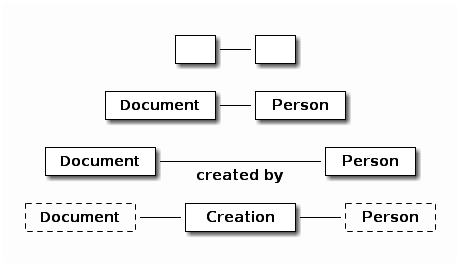
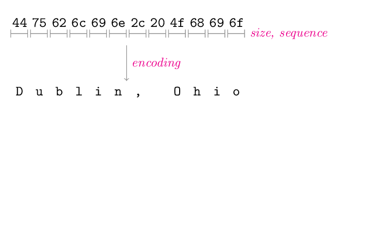
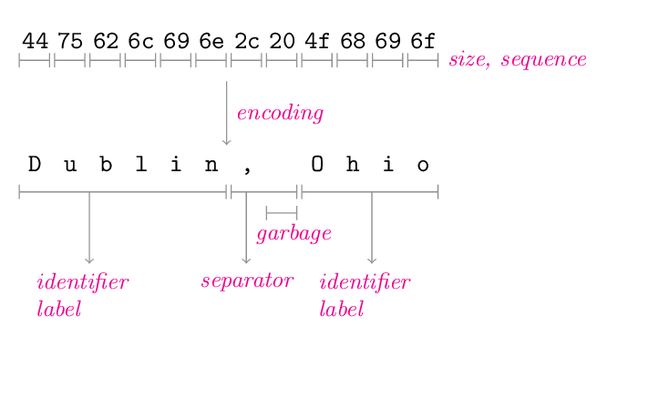
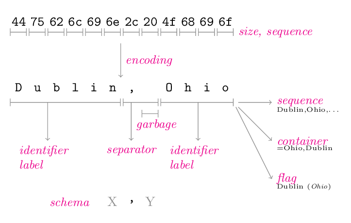

## Research question

More and more data, digital documents, metadata...

* How is data actually structured and described?

## What kind of data?

Different notions of data exist:

* **hard numbers**\
  facts and reproducible measurements
* **recorded observations**\
  subjective and with context
* **communicated documents**\
  data as digital signs

## Data as signs

Data = digital documents = digital objects = ...

* created/designed artifacts, used for communication
* connected to their meaning and content only by convention

## Data as signs

* part of an unlimited semiosis
* eventually given as sequences of bits
* (meta)data depends on the level of description

## Data modeling

Creation of data is an an act of design, often performed implicitly.

## Methods of data structuring & description

## Research question

<!--
* How are data, digital documents, data objects...
  actually structured and described?
-->

* What *common features* can be identified in different methods of
  data structuring and description, *independent from* particular
  technologies and trends?

## Results

1. **categorization** (5)\
   identify the intended purposes of methods\

2. **paradigms** (6)\
   reveal hidden assumptions and blind spots of
   methods and their applications

3. **pattern language** (20)\
   shows typical problems and solutions independent from
   particular trends and technologies

## 1. Categorization of data methods

What does a particular technology, standard etc. actually do?

* **encodings** (Unicode, Base64...)\
  *express* data
* **storage systems** (file systems, RDBMS...)\
  *store* data
* **identifier & query** (URI, XPath, SHA1...)\
  *refer to* data
* **structuring & markup** (XML, CSV, RDF...)\
  *structure* data
* **schema languages** (BNF, XSD, RDFS...)\
  *constrain* data
* **conceptual models** (ERM, mind maps, diagrams...)\
  *describe* data

## 2. Paradigm example: Entites and Connections

<!-- Data structuring and description is shaped by fundamental paradigms. -->

*...reveal hidden assumptions and blind spots that shape data*

<!-- its difficult to switch in this artificial selection -->

## 3. Pattern examples

## 3. Pattern examples

## 3. Pattern examples

## 3. The pattern language

> Patterns help us remember insights and knowledge about
> design and can be used in combination to create solutions

<!-- 
* The more familiar you are with a pattern language, the more useful it gets.
-->

## Applications, benefit, contribution

* Patterns are a novel approach for data analysis
* Show benefits and limitations of different methods
  of data structuring and description
* Possible Applications

    * data archeology
    * data linguistics
    * data integration
    * data modeling
    * ...

---

Thank you!

<!-- # Additional slides -->

## Phenomenological research method

<!--  
* intuiting > analyzing > describing
* phenomena must be experienced to reveal their *essence* 
* critical experiencing
-->

* Study of data methods as *phenomena*
* Comprehensive, in-depth collection and review of all methods 
* focus on conceptual properties, finally find
  common patterns

## Examples of methods and their limitations

* SQL is bad at repetition groups and trees
* RDF is bad at lists and closed sets
* XML is bad at connections
* Schema languages are difficult to understand
* Diagrams are informal
* ...

## Metadata

* Either metadata as measurements or facts
* Or metadata as data definition (schemas, formats, rules...)
* Any digital document that structures or describes other data
* Examples: hierarchical structure of a digital object (document, database, etc.),

## Possible Questions

* Why was **image/video/audio data** excluded from analysis?

    * Such data is mainly *data as recorded observatios*
      instead of *data as communicated documents*. For instance
      a bitmap image is just an array of pixels, each having a color.
      The interesting content of an image, however, is not in this
      structure but it can only be discoverd by measurement,
      similar to data mining (*data as hard numbers*).

* How does the results about data relate to **information**?

	* My thesis is not about information but about data.
      Data are *differences* (eventually bits) similar to
      information in Shannon's theory of information. In the
      general definition of information (GDI), information is
      "meaningful, well-formed data". With data as signs,
      information starts where models and meanings of data
      refer to outside of the digital domain.

## Possible Questions

* How does one find the **correct and accurate pattern** to
  represent a piece of information?

    * The patterns are not meant to *represent* data or
      information but to describe the problem or motivation
      that led to a particular form of data. There is not one
      *correct* pattern but there are adequate patterns.

    * For instance one might define a canoncial form to express
      sequences. This form, however, would not be the sequence
      pattern, but *one application* of the sequence pattern.
