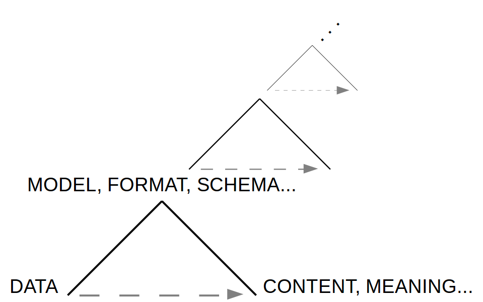
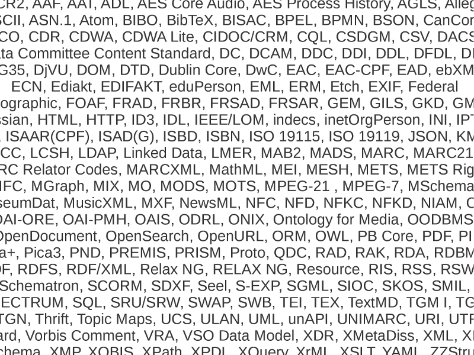
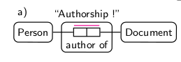
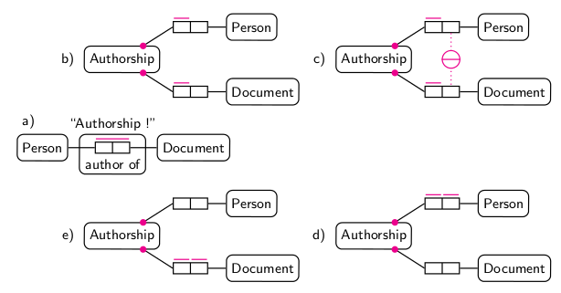
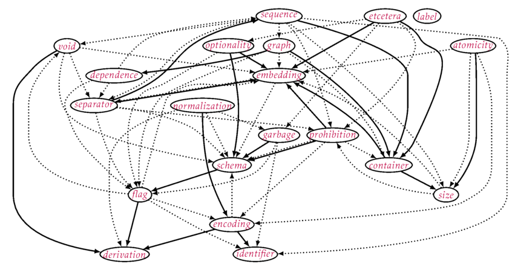
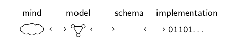

## Research question

More and more data, digital documents, metadata...

* How is data actually structured and described?

## What kind of data?

Different notions of data exist:

* **hard numbers**\
  facts and reproducible measurements
* **recorded observations**\
  subjective and with context
* **communicated documents**\
  data as digital signs

## Data as signs

Data = digital documents = digital objects = ...

* created/designed artifacts, used for communication
* connected to their meaning and content only by convention

## Data as signs

* part of an unlimited semiosis
* eventually given as sequences of bits
* (meta)data depends on the level of description

## Methods of data structuring & description

## Research question

<!--
* How are data, digital documents, data objects...
  actually structured and described?
-->

* What *common features* can be identified in different methods of
  data structuring and description, *independent from* particular
  technologies and trends?

## Phenomenological research method

<!--  
* intuiting > analyzing > describing
* phenomena must be experienced to reveal their *essence* 
-->

* Study of data methods as *phenomena*
* Comprehensive, in-depth collection and review of all methods 
* focus on conceptual properties, finally find
  common patterns

## Results

* **categorization** (5)\
  identify the intended purposes of methods\

* **paradigms** (6)\
  reveal hidden assumptions and blind spots of
  methods and their applications

* **pattern language** (20)\
  shows typical problems and solutions independent from
  particular trends and technologies

## Categorization of data methods

What does a particular technology, standard etc. actually do?

* **encodings** (Unicode, Base64...)\
  *express* data
* **storage systems** (file systems, RDBMS...)\
  *store* data
* **identifier & query** (URI, XPath, SHA1...)\
  *refer to* data
* **structuring & markup** (XML, CSV, RDF...)\
  *structure* data
* **schema languages** (BNF, XSD, RDFS...)\
  *constrain* data
* **conceptual models** (ERM, mind maps, diagrams...)\
  *describe* data

## Example of a paradigm: Entites and Connections

<!-- Data structuring and description is shaped by fundamental paradigms. -->

## Example of a paradigm: Entites and Connections

## The pattern language

> Patterns help us remember insights and knowledge about
> design and can be used in combination to create solutions

<!-- 
* The more familiar you are with a pattern language, the more useful it gets.
-->

## Example of a pattern / its application

...TODO...

## Applications, benefit, contribution

* Patterns as novel approach for data description
* Show benefits and limitations of different methods of
  data structuring and description
* Possible Applications

  * data archeology
  * data linguistics
  * ...

---

Thank you!

<!-- # Additional slides -->

## Data modeling

Creation of data is an creation as act of design.
Data modeling is often performed implicitly.

## Limits of particular methods

* SQL is bad at repetition groups and trees
* RDF is bad at lists and closed sets
* XML is bad at connections
* ...

## Metadata

Primary meaning of metadata: data definition (schemas, formats, rules...).
Metadata is any digital document that structures or describes other data.

examples: the hierarchical structure of a digital object (database, etc.),
if expressed in some form, is metadata.

## Possible Questions

* what about image/video/audio data?
* ...
